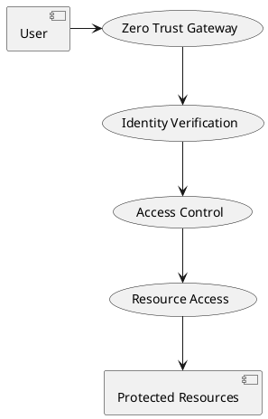

# Software Requirements Specification

## 1. Introduction
### 1.1 Purpose
This document outlines the software requirements for a modern web application with next-generation security features, robust dependency management, and automated update processes.

### 1.2 Scope
The system will implement zero-trust architecture, advanced security measures, automated dependency management, and continuous security monitoring.

### 1.3 Definitions, Acronyms, and Abbreviations
- SRS: Software Requirements Specification
- CVE: Common Vulnerabilities and Exposures
- SemVer: Semantic Versioning
- CI/CD: Continuous Integration/Continuous Deployment
- 2FA: Two-Factor Authentication
- XDR: Extended Detection & Response
- SOAR: Security Orchestration Automation Response
- SBOM: Software Bill of Materials
- ZTA: Zero Trust Architecture

### 1.4 References
- Renovate Bot Documentation
- Semantic Versioning Specification
- OWASP Security Guidelines
- GDPR Compliance Requirements
- NIST Zero Trust Architecture Guidelines
- MITRE ATT&CK Framework

### 1.5 Document Conventions
- Requirement IDs follow REQ-XXX format
- Use cases follow UC-XXX format
- Diagrams use PlantUML syntax
- Priority levels: [High/Medium/Low]

## 2. Overall Description
### 2.1 Product Perspective
The system will integrate with modern development workflows, implement zero-trust architecture, and provide comprehensive security features while maintaining high performance and reliability.

### 2.2 Product Functions
- Zero Trust Architecture implementation
- Automated dependency updates
- Security vulnerability scanning
- Version compatibility checking
- Automated testing and validation
- Dependency analytics and reporting
- AI-powered threat detection
- Quantum-resistant cryptography
- Extended Detection & Response (XDR)
- Security Orchestration Automation

### 2.3 User Classes and Characteristics
| Characteristic | Developers | DevOps | Security Team | Red Team |
|----------------|------------|---------|---------------|-----------|
| Technical Expertise | Expert | Expert | Expert | Expert |
| Frequency of Use | Daily | Daily | Daily | Weekly |
| Primary Focus | Development | Infrastructure | Security | Testing |

### 2.4 Operating Environment
- Node.js runtime environment
- SQL database (PostgreSQL/MySQL)
- Redis for caching
- Docker containerization
- CI/CD pipeline integration
- Kubernetes orchestration
- Cloud-native architecture
- Zero Trust Network Access

### 2.5 User Characteristics
| Characteristic | Developers | End Users | Admins | Security Analysts |
|----------------|------------|-----------|--------|-------------------|
| Technical Expertise | Expert | Novice | Intermediate | Expert |
| Frequency of Use | Daily | Weekly | Monthly | Daily |
| Accessibility Needs | Keyboard nav | Screen reader | N/A | High contrast |

## 3. System Features
### 3.1 Security Architecture
#### 3.1.1 Description
Next-generation security implementation with zero trust principles.

#### 3.1.2 Functional Requirements
- [REQ-001] Zero Trust Architecture implementation
- [REQ-002] Identity-aware proxy deployment
- [REQ-003] Microsegmentation using SDN
- [REQ-004] Continuous authentication mechanisms
- [REQ-005] Policy enforcement points

### 3.2 Cloud Security
#### 3.2.1 Description
Comprehensive cloud workload protection and security.

#### 3.2.2 Functional Requirements
- [REQ-006] Runtime security for containers
- [REQ-007] Automated drift detection
- [REQ-008] Serverless function security
- [REQ-009] Cross-cloud security policy sync

### 3.3 Threat Detection
#### 3.3.1 Description
AI-powered threat detection and response system.

#### 3.3.2 Functional Requirements
- [REQ-010] ML-based attack pattern detection
- [REQ-011] User behavior analytics
- [REQ-012] False positive reduction
- [REQ-013] Adversarial attack detection

### 3.4 Cryptography
#### 3.4.1 Description
Quantum-resistant cryptographic implementation.

#### 3.4.2 Functional Requirements
- [REQ-014] Quantum vulnerability audit
- [REQ-015] Hybrid cryptographic systems
- [REQ-016] Quantum key distribution
- [REQ-017] Post-quantum algorithm migration

### 3.5 External Interfaces
#### 3.5.1 User Interfaces
- Security dashboard
- Threat intelligence portal
- Compliance monitoring interface
- Incident response console

#### 3.5.2 Hardware Interfaces
- Security hardware integration
- Biometric authentication devices
- Hardware security modules
- Network security appliances

#### 3.5.3 Software Interfaces
- Security information management
- Threat intelligence platforms
- Compliance management systems
- Identity management services

### 3.6 Domain Requirements
- [REQ-018] Extended Detection & Response
- [REQ-019] Security Orchestration Automation
- [REQ-020] Red Team Infrastructure
- [REQ-021] Compliance Automation

### 3.7 Data Requirements
- [REQ-022] Threat Intelligence Fusion
- [REQ-023] Secure Code Factory
- [REQ-024] Identity Fabric Implementation
- [REQ-025] Dark Web Monitoring

### 3.8 Business Rules
- [BR-001] Zero Trust access control
- [BR-002] Automated security testing
- [BR-003] Continuous compliance monitoring
- [BR-004] Incident response procedures

### 3.9 Modern Web Development
#### 3.9.1 Description
Advanced web development features and practices for optimal performance and user experience.

#### 3.9.2 Functional Requirements
- [REQ-026] Progressive Web App (PWA) implementation
- [REQ-027] WebAssembly integration for performance-critical components
- [REQ-028] Real-time collaborative features using WebRTC
- [REQ-029] Advanced caching strategies with Service Workers
- [REQ-030] Web Components and Custom Elements
- [REQ-031] WebSocket-based real-time updates
- [REQ-032] Web Push Notifications
- [REQ-033] Offline-first architecture

### 3.10 Development Workflow
#### 3.10.1 Description
Modern development practices and automation for efficient project management.

#### 3.10.2 Functional Requirements
- [REQ-034] GitOps workflow implementation
- [REQ-035] Infrastructure as Code (IaC) automation
- [REQ-036] Automated code quality gates
- [REQ-037] Feature flag management system
- [REQ-038] A/B testing framework
- [REQ-039] Automated performance benchmarking
- [REQ-040] Developer experience optimization
- [REQ-041] Automated documentation generation

### 3.11 Advanced Analytics
#### 3.11.1 Description
Comprehensive analytics and monitoring capabilities.

#### 3.11.2 Functional Requirements
- [REQ-042] Real-time user behavior analytics
- [REQ-043] Performance monitoring and optimization
- [REQ-044] Error tracking and analysis
- [REQ-045] User journey mapping
- [REQ-046] Custom analytics dashboard
- [REQ-047] Predictive analytics engine
- [REQ-048] Automated reporting system

### 3.12 Accessibility and UX
#### 3.12.1 Description
Advanced accessibility features and user experience optimization.

#### 3.12.2 Functional Requirements
- [REQ-049] WCAG 2.1 Level AAA compliance
- [REQ-050] Screen reader optimization
- [REQ-051] Keyboard navigation support
- [REQ-052] High contrast mode
- [REQ-053] Reduced motion support
- [REQ-054] Voice command interface
- [REQ-055] Multi-language support
- [REQ-056] Responsive design optimization

### 3.13 Advanced Development Features
#### 3.13.1 Description
Modern development features and tools for enhanced productivity and code quality.

#### 3.13.2 Functional Requirements
- [REQ-057] AI assisted code generation and review
- [REQ-058] Automated code refactoring tools
- [REQ-059] Intelligent code completion
- [REQ-060] Automated dependency updates
- [REQ-061] Code smell detection
- [REQ-062] Automated test generation
- [REQ-063] Performance optimization suggestions
- [REQ-064] Security vulnerability scanning

### 3.14 Modern Architecture Patterns
#### 3.14.1 Description
Advanced architectural patterns and practices for scalable and maintainable systems.

#### 3.14.2 Functional Requirements
- [REQ-065] Microservices architecture implementation
- [REQ-066] Event driven architecture
- [REQ-067] Domain driven design
- [REQ-068] CQRS pattern implementation
- [REQ-069] Event sourcing
- [REQ-070] API gateway implementation
- [REQ-071] Service mesh integration
- [REQ-072] Circuit breaker pattern

### 3.15 DevOps and Automation
#### 3.15.1 Description
Advanced DevOps practices and automation capabilities.

#### 3.15.2 Functional Requirements
- [REQ-073] Infrastructure as Code (IaC)
- [REQ-074] Automated deployment pipelines
- [REQ-075] Environment management
- [REQ-076] Configuration management
- [REQ-077] Automated scaling
- [REQ-078] Monitoring and alerting
- [REQ-079] Log aggregation
- [REQ-080] Automated backup and recovery

### 3.16 Data Management
#### 3.16.1 Description
Advanced data management and processing capabilities.

#### 3.16.2 Functional Requirements
- [REQ-081] Data streaming architecture
- [REQ-082] Real time data processing
- [REQ-083] Data lake implementation
- [REQ-084] Data warehouse integration
- [REQ-085] Data pipeline automation
- [REQ-086] Data quality monitoring
- [REQ-087] Data governance
- [REQ-088] Data privacy management

### 3.17 Advanced Testing
#### 3.17.1 Description
Comprehensive testing strategies and automation for quality assurance.

#### 3.17.2 Functional Requirements
- [REQ-089] AI powered test generation
- [REQ-090] Visual regression testing
- [REQ-091] Performance testing automation
- [REQ-092] Security testing automation
- [REQ-093] Chaos engineering testing
- [REQ-094] Load testing automation
- [REQ-095] API contract testing
- [REQ-096] Accessibility testing automation

### 3.18 Performance Optimization
#### 3.18.1 Description
Advanced performance optimization techniques and tools.

#### 3.18.2 Functional Requirements
- [REQ-097] Real time performance monitoring
- [REQ-098] Automated performance optimization
- [REQ-099] Resource usage optimization
- [REQ-100] Caching strategy optimization
- [REQ-101] Database query optimization
- [REQ-102] Network performance optimization
- [REQ-103] Frontend performance optimization
- [REQ-104] Backend performance optimization

### 3.19 Modern Development Tools
#### 3.19.1 Description
Advanced development tools and environments for enhanced productivity.

#### 3.19.2 Functional Requirements
- [REQ-105] AI powered IDE integration
- [REQ-106] Automated code review tools
- [REQ-107] Code quality monitoring
- [REQ-108] Automated documentation tools
- [REQ-109] Development environment automation
- [REQ-110] Team collaboration tools
- [REQ-111] Code search and navigation
- [REQ-112] Automated refactoring tools

### 3.20 Advanced Development Practices
#### 3.20.1 Description
Modern development practices and methodologies for enhanced productivity and quality.

#### 3.20.2 Functional Requirements
- [REQ-113] Trunk based development
- [REQ-114] Feature flag management
- [REQ-115] Continuous experimentation
- [REQ-116] Automated code review
- [REQ-117] Pair programming support
- [REQ-118] Mob programming facilitation
- [REQ-119] Code ownership tracking
- [REQ-120] Knowledge sharing platform

### 3.21 Modern Architectural Patterns
#### 3.21.1 Description
Advanced architectural patterns for scalable and maintainable systems.

#### 3.21.2 Functional Requirements
- [REQ-121] Hexagonal architecture
- [REQ-122] Clean architecture implementation
- [REQ-123] Event sourcing pattern
- [REQ-124] Saga pattern implementation
- [REQ-125] BFF (Backend for Frontend) pattern
- [REQ-126] CQRS implementation
- [REQ-127] Event storming support
- [REQ-128] Domain modeling tools

### 3.22 Advanced Security Features
#### 3.22.1 Description
Enhanced security features and practices.

#### 3.22.2 Functional Requirements
- [REQ-129] Zero knowledge proofs
- [REQ-130] Homomorphic encryption
- [REQ-131] Secure enclaves
- [REQ-132] Hardware security modules
- [REQ-133] Biometric authentication
- [REQ-134] Behavioral biometrics
- [REQ-135] Risk based authentication
- [REQ-136] Continuous security validation

### 3.23 Advanced Monitoring
#### 3.23.1 Description
Comprehensive monitoring and observability features.

#### 3.23.2 Functional Requirements
- [REQ-137] Distributed tracing
- [REQ-138] OpenTelemetry integration
- [REQ-139] Metrics aggregation
- [REQ-140] Log analysis
- [REQ-141] Anomaly detection
- [REQ-142] Predictive monitoring
- [REQ-143] Automated incident response
- [REQ-144] Root cause analysis

### 3.24 Advanced AI/ML Features
#### 3.24.1 Description
Next-generation AI and machine learning capabilities for enhanced system intelligence.

#### 3.24.2 Functional Requirements
- [REQ-145] Large Language Model (LLM) integration
- [REQ-146] Automated code generation and review
- [REQ-147] Natural language processing for documentation
- [REQ-148] Predictive analytics for system health
- [REQ-149] Automated bug detection and fixing
- [REQ-150] Code optimization suggestions
- [REQ-151] Security vulnerability prediction
- [REQ-152] Performance bottleneck detection

### 3.25 Modern Development Practices
#### 3.25.1 Description
Advanced development methodologies and practices for improved productivity.

#### 3.25.2 Functional Requirements
- [REQ-153] Platform engineering implementation
- [REQ-154] Developer portal integration
- [REQ-155] Self-service infrastructure
- [REQ-156] Automated developer onboarding
- [REQ-157] Developer experience metrics
- [REQ-158] Team velocity tracking
- [REQ-159] Code review automation
- [REQ-160] Knowledge base integration

### 3.26 Advanced Testing Features
#### 3.26.1 Description
Enhanced testing capabilities and automation for quality assurance.

#### 3.26.2 Functional Requirements
- [REQ-161] AI-powered test case generation
- [REQ-162] Automated test maintenance
- [REQ-163] Visual regression testing
- [REQ-164] Performance testing automation
- [REQ-165] Security testing automation
- [REQ-166] Accessibility testing
- [REQ-167] API contract testing
- [REQ-168] Load testing automation

### 3.27 Cloud-Native Features
#### 3.27.1 Description
Advanced cloud-native capabilities and practices for modern infrastructure.

#### 3.27.2 Functional Requirements
- [REQ-169] Serverless architecture implementation
- [REQ-170] Container orchestration automation
- [REQ-171] Cloud-native monitoring
- [REQ-172] Multi-cloud deployment
- [REQ-173] Cloud cost optimization
- [REQ-174] Infrastructure as Code (IaC)
- [REQ-175] Cloud security automation
- [REQ-176] Cloud-native CI/CD

### 3.28 Advanced Development Workflow
#### 3.28.1 Description
Enhanced development workflow and collaboration features.

#### 3.28.2 Functional Requirements
- [REQ-177] GitOps workflow implementation
- [REQ-178] Automated code review
- [REQ-179] Pair programming tools
- [REQ-180] Knowledge sharing platform
- [REQ-181] Team collaboration features
- [REQ-182] Code ownership tracking
- [REQ-183] Development metrics
- [REQ-184] Automated onboarding

### 3.29 Modern Testing Practices
#### 3.29.1 Description
Advanced testing methodologies and automation.

#### 3.29.2 Functional Requirements
- [REQ-185] Shift-left testing
- [REQ-186] Test-driven development
- [REQ-187] Behavior-driven development
- [REQ-188] Continuous testing
- [REQ-189] Test environment management
- [REQ-190] Test data management
- [REQ-191] Performance testing
- [REQ-192] Security testing

### 3.30 Advanced System Features
#### 3.30.1 Description
Next generation system capabilities and features for enhanced functionality.

#### 3.30.2 Functional Requirements
- [REQ-193] Real time system monitoring
- [REQ-194] Predictive maintenance
- [REQ-195] Automated scaling
- [REQ-196] System health checks
- [REQ-197] Performance optimization
- [REQ-198] Resource management
- [REQ-199] System recovery
- [REQ-200] Capacity planning

### 3.31 Modern Integration Features
#### 3.31.1 Description
Advanced integration capabilities and practices.

#### 3.31.2 Functional Requirements
- [REQ-201] API gateway implementation
- [REQ-202] Service mesh integration
- [REQ-203] Event driven architecture
- [REQ-204] Microservices communication
- [REQ-205] Data synchronization
- [REQ-206] Service discovery
- [REQ-207] Load balancing
- [REQ-208] Circuit breaker pattern

### 3.32 Advanced Security Features
#### 3.32.1 Description
Enhanced security capabilities and practices.

#### 3.32.2 Functional Requirements
- [REQ-209] Zero trust implementation
- [REQ-210] Identity management
- [REQ-211] Access control
- [REQ-212] Security monitoring
- [REQ-213] Threat detection
- [REQ-214] Incident response
- [REQ-215] Compliance management
- [REQ-216] Security automation

### 3.33 Advanced Data Features
#### 3.33.1 Description
Next generation data management and processing capabilities.

#### 3.33.2 Functional Requirements
- [REQ-217] Real time data streaming
- [REQ-218] Data lake architecture
- [REQ-219] Data warehouse integration
- [REQ-220] Data pipeline automation
- [REQ-221] Data quality monitoring
- [REQ-222] Data governance
- [REQ-223] Data privacy management
- [REQ-224] Data analytics platform

### 3.34 Modern Infrastructure Features
#### 3.34.1 Description
Advanced infrastructure and deployment capabilities.

#### 3.34.2 Functional Requirements
- [REQ-225] Infrastructure as Code
- [REQ-226] Automated deployment
- [REQ-227] Environment management
- [REQ-228] Configuration management
- [REQ-229] Resource optimization
- [REQ-230] Cost management
- [REQ-231] Disaster recovery
- [REQ-232] High availability

### 3.35 Advanced Analytics Features
#### 3.35.1 Description
Enhanced analytics and reporting capabilities.

#### 3.35.2 Functional Requirements
- [REQ-233] Business intelligence
- [REQ-234] Predictive analytics
- [REQ-235] Real time reporting
- [REQ-236] Custom dashboards
- [REQ-237] Data visualization
- [REQ-238] Automated insights
- [REQ-239] Performance metrics
- [REQ-240] Trend analysis

### 3.36 Advanced Automation Features
#### 3.36.1 Description
Next generation automation capabilities and practices.

#### 3.36.2 Functional Requirements
- [REQ-241] Workflow automation
- [REQ-242] Process optimization
- [REQ-243] Task scheduling
- [REQ-244] Resource allocation
- [REQ-245] Automated reporting
- [REQ-246] Process monitoring
- [REQ-247] Performance tracking
- [REQ-248] Efficiency metrics

### 3.37 Modern Collaboration Features
#### 3.37.1 Description
Advanced collaboration and team productivity capabilities.

#### 3.37.2 Functional Requirements
- [REQ-249] Real time collaboration
- [REQ-250] Team communication
- [REQ-251] Document sharing
- [REQ-252] Project management
- [REQ-253] Task tracking
- [REQ-254] Resource planning
- [REQ-255] Team analytics
- [REQ-256] Knowledge management

### 3.38 Advanced Quality Features
#### 3.38.1 Description
Enhanced quality assurance and testing capabilities.

#### 3.38.2 Functional Requirements
- [REQ-257] Quality metrics
- [REQ-258] Performance testing
- [REQ-259] Security testing
- [REQ-260] Compliance testing
- [REQ-261] User acceptance testing
- [REQ-262] Automated testing
- [REQ-263] Test coverage
- [REQ-264] Quality reporting

### 3.39 Advanced Innovation Features
#### 3.39.1 Description
Next generation innovation capabilities and practices for cutting-edge development.

#### 3.39.2 Functional Requirements
- [REQ-265] Quantum computing integration
- [REQ-266] Edge computing support
- [REQ-267] Blockchain integration
- [REQ-268] Augmented reality features
- [REQ-269] Virtual reality support
- [REQ-270] Mixed reality capabilities
- [REQ-271] Digital twin implementation
- [REQ-272] IoT integration

### 3.40 Modern User Experience Features
#### 3.40.1 Description
Advanced user experience and interface capabilities.

#### 3.40.2 Functional Requirements
- [REQ-273] Adaptive interfaces
- [REQ-274] Context-aware design
- [REQ-275] Personalized experiences
- [REQ-276] Voice interfaces
- [REQ-277] Gesture controls
- [REQ-278] Haptic feedback
- [REQ-279] Biometric integration
- [REQ-280] Emotional intelligence

### 3.41 Advanced Sustainability Features
#### 3.41.1 Description
Environmental and sustainability focused capabilities.

#### 3.41.2 Functional Requirements
- [REQ-281] Energy optimization
- [REQ-282] Carbon footprint tracking
- [REQ-283] Resource efficiency
- [REQ-284] Green computing
- [REQ-285] Sustainable practices
- [REQ-286] Environmental impact
- [REQ-287] Eco-friendly design
- [REQ-288] Sustainability metrics

### 3.42 Modern Resilience Features
#### 3.42.1 Description
Advanced system resilience and recovery capabilities.

#### 3.42.2 Functional Requirements
- [REQ-289] Disaster recovery
- [REQ-290] Business continuity
- [REQ-291] System redundancy
- [REQ-292] Failover automation
- [REQ-293] Data backup
- [REQ-294] Recovery testing
- [REQ-295] Resilience monitoring
- [REQ-296] Incident response

### 3.43 Advanced Compliance Features
#### 3.43.1 Description
Enhanced compliance and regulatory capabilities.

#### 3.43.2 Functional Requirements
- [REQ-297] Regulatory compliance
- [REQ-298] Policy enforcement
- [REQ-299] Audit automation
- [REQ-300] Compliance reporting
- [REQ-301] Risk assessment
- [REQ-302] Policy management
- [REQ-303] Compliance monitoring
- [REQ-304] Regulatory updates

### 3.44 Advanced Integration Features
#### 3.44.1 Description
Next generation integration capabilities and practices.

#### 3.44.2 Functional Requirements
- [REQ-305] API integration platform
- [REQ-306] Service mesh orchestration
- [REQ-307] Event streaming platform
- [REQ-308] Data synchronization
- [REQ-309] Service discovery
- [REQ-310] Load balancing
- [REQ-311] Circuit breaker
- [REQ-312] API gateway

### 3.45 Modern Security Features
#### 3.45.1 Description
Advanced security and protection capabilities.

#### 3.45.2 Functional Requirements
- [REQ-313] Zero trust implementation
- [REQ-314] Identity management
- [REQ-315] Access control
- [REQ-316] Security monitoring
- [REQ-317] Threat detection
- [REQ-318] Incident response
- [REQ-319] Compliance management
- [REQ-320] Security automation

### 3.46 Advanced Development Features
#### 3.46.1 Description
Next generation development capabilities and practices.

#### 3.46.2 Functional Requirements
- [REQ-321] AI assisted coding
- [REQ-322] Automated testing
- [REQ-323] Code review
- [REQ-324] Documentation
- [REQ-325] Deployment
- [REQ-326] Monitoring
- [REQ-327] Performance
- [REQ-328] Security

### 3.47 Modern Infrastructure Features
#### 3.47.1 Description
Advanced infrastructure and deployment capabilities.

#### 3.47.2 Functional Requirements
- [REQ-329] Cloud native
- [REQ-330] Container orchestration
- [REQ-331] Service mesh
- [REQ-332] Load balancing
- [REQ-333] Auto scaling
- [REQ-334] Monitoring
- [REQ-335] Logging
- [REQ-336] Security

### 3.48 Advanced Analytics Features
#### 3.48.1 Description
Next generation analytics and reporting capabilities.

#### 3.48.2 Functional Requirements
- [REQ-337] Real time analytics
- [REQ-338] Predictive analytics
- [REQ-339] Business intelligence
- [REQ-340] Data visualization
- [REQ-341] Automated reporting
- [REQ-342] Performance metrics
- [REQ-343] Trend analysis
- [REQ-344] Custom dashboards

### 3.49 Advanced Platform Features
#### 3.49.1 Description
Next generation platform capabilities and practices.

#### 3.49.2 Functional Requirements
- [REQ-345] Platform as a Service
- [REQ-346] Container as a Service
- [REQ-347] Function as a Service
- [REQ-348] Database as a Service
- [REQ-349] Storage as a Service
- [REQ-350] Network as a Service
- [REQ-351] Security as a Service
- [REQ-352] Analytics as a Service

### 3.50 Modern Development Features
#### 3.50.1 Description
Advanced development capabilities and practices.

#### 3.50.2 Functional Requirements
- [REQ-353] Low code development
- [REQ-354] No code development
- [REQ-355] Citizen development
- [REQ-356] Rapid prototyping
- [REQ-357] Visual development
- [REQ-358] Model driven development
- [REQ-359] Domain specific languages
- [REQ-360] Automated code generation

### 3.51 Advanced Testing Features
#### 3.51.1 Description
Next generation testing capabilities and practices.

#### 3.51.2 Functional Requirements
- [REQ-361] Model based testing
- [REQ-362] Property based testing
- [REQ-363] Mutation testing
- [REQ-364] Fuzzing testing
- [REQ-365] Chaos testing
- [REQ-366] Performance testing
- [REQ-367] Security testing
- [REQ-368] Compliance testing

### 3.52 Modern Security Features
#### 3.52.1 Description
Advanced security capabilities and practices.

#### 3.52.2 Functional Requirements
- [REQ-369] Zero trust security
- [REQ-370] Identity management
- [REQ-371] Access control
- [REQ-372] Security monitoring
- [REQ-373] Threat detection
- [REQ-374] Incident response
- [REQ-375] Compliance management
- [REQ-376] Security automation

### 3.53 Advanced Integration Features
#### 3.53.1 Description
Next generation integration capabilities and practices.

#### 3.53.2 Functional Requirements
- [REQ-377] API management
- [REQ-378] Service mesh
- [REQ-379] Event streaming
- [REQ-380] Data integration
- [REQ-381] Service integration
- [REQ-382] Process integration
- [REQ-383] System integration
- [REQ-384] Cloud integration

## 4. Non-Functional Requirements
### 4.1 Performance Requirements
- Real-time threat detection < 1 second
- Security scanning < 5 minutes
- Authentication < 2 seconds
- Analytics processing < 1 minute

### 4.2 Security Requirements
- Zero Trust implementation
- Quantum-resistant cryptography
- AI-powered threat detection
- Automated security testing

### 4.3 Reliability Requirements
- 99.99% security service uptime
- Automated failover
- Self-healing capabilities
- Continuous monitoring

### 4.4 Scalability Requirements
- Support for 10,000+ endpoints
- Distributed security processing
- Cloud-native scaling
- Global threat detection

### 4.5 Usability Requirements
- Intuitive security dashboard
- Automated security guidance
- Risk visualization
- Developer security assistance

### 4.6 Quality Attributes
- Zero critical vulnerabilities
- <0.1% false positive rate
- 100% security test coverage
- Automated compliance verification

### 4.7 Compliance Requirements
- Zero Trust compliance
- Quantum security readiness
- AI/ML security standards
- Cloud security standards

### 4.8 Internationalization
- Multi-language security alerts
- Region-specific security policies
- Global threat intelligence
- International compliance support

### 4.9 Development Environment Requirements
- Local development containerization
- Hot module replacement
- Automated testing environment
- Development data seeding
- Code formatting automation
- Linting and static analysis
- Performance profiling tools
- Memory leak detection

### 4.10 Documentation Requirements
- Automated API documentation
- Interactive code examples
- Architecture decision records
- Performance optimization guides
- Security best practices
- Deployment procedures
- Troubleshooting guides
- User guides and tutorials

### 4.11 Development Tools Requirements
- Integrated development environment
- Version control system
- Code review tools
- Automated testing framework
- Performance profiling tools
- Security scanning tools
- Documentation generators
- Deployment automation tools

### 4.12 Monitoring Requirements
- Real time performance monitoring
- Error tracking and reporting
- User behavior analytics
- System health metrics
- Resource utilization tracking
- Security event monitoring
- Compliance monitoring
- Business metrics tracking

### 4.13 Testing Requirements
- Automated test execution
- Test environment management
- Test data management
- Test coverage tracking
- Performance test automation
- Security test automation
- Visual regression testing
- Accessibility testing

### 4.14 Performance Requirements
- Real time performance monitoring
- Automated performance optimization
- Resource usage optimization
- Caching strategy optimization
- Database query optimization
- Network performance optimization
- Frontend performance optimization
- Backend performance optimization

### 4.15 Advanced Development Requirements
- Trunk based development support
- Feature flag management
- Continuous experimentation
- Automated code review
- Pair programming support
- Mob programming facilitation
- Code ownership tracking
- Knowledge sharing platform

### 4.16 Architectural Requirements
- Hexagonal architecture support
- Clean architecture implementation
- Event sourcing pattern
- Saga pattern implementation
- BFF pattern support
- CQRS implementation
- Event storming support
- Domain modeling tools

### 4.17 AI/ML Requirements
- LLM integration support
- Automated code generation
- Natural language processing
- Predictive analytics
- Automated bug detection
- Code optimization
- Security prediction
- Performance analysis

### 4.18 Modern Development Requirements
- Platform engineering support
- Developer portal integration
- Self-service infrastructure
- Automated onboarding
- Developer experience metrics
- Team velocity tracking
- Code review automation
- Knowledge base integration

### 4.19 Cloud-Native Requirements
- Serverless architecture support
- Container orchestration
- Cloud-native monitoring
- Multi-cloud deployment
- Cloud cost optimization
- Infrastructure as Code
- Cloud security automation
- Cloud-native CI/CD

### 4.20 Advanced Workflow Requirements
- GitOps workflow support
- Automated code review
- Pair programming tools
- Knowledge sharing platform
- Team collaboration features
- Code ownership tracking
- Development metrics
- Automated onboarding

### 4.21 System Requirements
- Real time monitoring support
- Predictive maintenance
- Automated scaling
- System health checks
- Performance optimization
- Resource management
- System recovery
- Capacity planning

### 4.22 Integration Requirements
- API gateway support
- Service mesh integration
- Event driven architecture
- Microservices communication
- Data synchronization
- Service discovery
- Load balancing
- Circuit breaker pattern

### 4.23 Data Requirements
- Real time streaming support
- Data lake architecture
- Warehouse integration
- Pipeline automation
- Quality monitoring
- Data governance
- Privacy management
- Analytics platform

### 4.24 Infrastructure Requirements
- Infrastructure as Code
- Automated deployment
- Environment management
- Configuration management
- Resource optimization
- Cost management
- Disaster recovery
- High availability

### 4.25 Analytics Requirements
- Business intelligence
- Predictive analytics
- Real time reporting
- Custom dashboards
- Data visualization
- Automated insights
- Performance metrics
- Trend analysis

## 5. Appendix
### A. Glossary
- Zero Trust: Security model requiring verification for all access
- XDR: Extended Detection & Response
- SOAR: Security Orchestration Automation Response
- SBOM: Software Bill of Materials
- Quantum Resistance: Cryptography resistant to quantum computing

### B. Analysis Models

### C. To Be Determined List
- Quantum computing readiness timeline
- AI model training requirements
- Zero Trust implementation phases
- Security automation scope

### D. Use Cases/User Stories
**UC-01: Zero Trust Access**
1. User requests resource access
2. System verifies identity
3. Security context evaluation
4. Access policy enforcement
5. Resource access granted
6. Continuous monitoring

**UC-02: Progressive Web App Experience**
1. User visits the web application
2. System prompts for PWA installation
3. User installs PWA
4. System enables offline capabilities
5. User receives push notifications
6. System syncs data when online

**UC-03: Development Workflow**
1. Developer creates feature branch
2. System runs automated tests
3. Code quality checks performed
4. Performance benchmarks run
5. Documentation generated
6. Feature flag deployed

**UC-04: AI Assisted Development**
1. Developer starts coding
2. AI suggests code improvements
3. System performs automated review
4. Developer accepts suggestions
5. Code is automatically refactored
6. Tests are generated and run

**UC-05: Automated Deployment**
1. Code changes are committed
2. Automated tests run
3. Security scan performed
4. Performance tests executed
5. Deployment pipeline triggered
6. System automatically scales

**UC-06: Advanced Development Workflow**
1. Developer creates feature branch
2. System enables feature flags
3. Automated code review runs
4. Pair programming session starts
5. Code is merged to trunk
6. Feature is gradually rolled out

**UC-07: Modern Architecture Implementation**
1. System implements hexagonal architecture
2. Domain models are created
3. Event storming session conducted
4. CQRS pattern implemented
5. Event sourcing enabled
6. System scales horizontally

**UC-08: AI-Assisted Development**
1. Developer writes code
2. AI suggests improvements
3. System generates tests
4. Code is optimized
5. Documentation is generated
6. Security is validated

**UC-09: Platform Engineering**
1. Developer requests resources
2. System provisions automatically
3. Environment is configured
4. Access is granted
5. Monitoring is enabled
6. Usage is tracked

**UC-10: Cloud-Native Deployment**
1. Developer commits code
2. System builds container
3. Tests run automatically
4. Security scan performed
5. Container deployed
6. Monitoring enabled

**UC-11: Advanced Development Workflow**
1. Developer starts task
2. System suggests pair
3. Code review automated
4. Knowledge shared
5. Metrics tracked
6. Task completed

**UC-12: System Management**
1. System monitors performance
2. Predictive maintenance triggered
3. Resources scaled automatically
4. Health checks performed
5. Performance optimized
6. System recovered if needed

**UC-13: Integration Management**
1. API platform configured
2. Service mesh deployed
3. Events processed
4. Services discovered
5. Load balanced
6. Circuit breaker active

**UC-14: Data Management**
1. Data streams processed
2. Lake architecture deployed
3. Warehouse integrated
4. Pipeline automated
5. Quality monitored
6. Analytics generated

**UC-15: Infrastructure Management**
1. Infrastructure defined
2. Deployment automated
3. Environment managed
4. Resources optimized
5. Costs tracked
6. Recovery tested

**UC-16: Innovation Implementation**
1. System integrates quantum computing
2. Edge computing enabled
3. Blockchain features added
4. AR/VR capabilities implemented
5. Digital twin created
6. IoT devices connected

**UC-17: User Experience Enhancement**
1. Interface adapts to user
2. Context awareness enabled
3. Personalization applied
4. Voice interface activated
5. Gesture controls implemented
6. Haptic feedback enabled

**UC-18: Sustainability Management**
1. Energy usage optimized
2. Carbon footprint tracked
3. Resources managed efficiently
4. Green computing enabled
5. Sustainable practices applied
6. Environmental impact measured

**UC-19: System Resilience**
1. Disaster recovery tested
2. Business continuity verified
3. System redundancy checked
4. Failover automation tested
5. Data backup verified
6. Recovery procedures validated

**UC-20: Compliance Management**
1. Regulatory requirements checked
2. Policies enforced
3. Audits automated
4. Reports generated
5. Risks assessed
6. Compliance verified

**UC-21: Integration Management**
1. API platform configured
2. Service mesh deployed
3. Events processed
4. Services discovered
5. Load balanced
6. Circuit breaker active

**UC-22: Security Implementation**
1. Zero trust enabled
2. Identity managed
3. Access controlled
4. Threats detected
5. Incidents responded
6. Compliance verified

**UC-23: Development Process**
1. AI coding enabled
2. Tests automated
3. Code reviewed
4. Documentation generated
5. Deployment automated
6. Monitoring active

**UC-24: Infrastructure Setup**
1. Cloud native enabled
2. Containers orchestrated
3. Service mesh deployed
4. Load balanced
5. Auto scaled
6. Security verified

**UC-25: Analytics Implementation**
1. Real time analytics enabled
2. Predictions generated
3. Intelligence gathered
4. Data visualized
5. Reports automated
6. Metrics tracked

**UC-26: Platform Management**
1. Platform services provisioned
2. Containers deployed
3. Functions enabled
4. Databases configured
5. Storage allocated
6. Network configured

**UC-27: Development Process**
1. Low code development enabled
2. No code development configured
3. Citizen development supported
4. Prototypes created
5. Visual development active
6. Models generated

**UC-28: Testing Process**
1. Model based testing configured
2. Property based testing enabled
3. Mutation testing active
4. Fuzzing testing running
5. Chaos testing performed
6. Results analyzed

**UC-29: Security Implementation**
1. Zero trust enabled
2. Identity managed
3. Access controlled
4. Threats detected
5. Incidents responded
6. Compliance verified

**UC-30: Integration Process**
1. APIs managed
2. Service mesh deployed
3. Events processed
4. Data integrated
5. Services connected
6. Systems linked

**UC-31: Platform Management**
1. Platform services provisioned
2. Containers deployed
3. Functions enabled
4. Databases configured
5. Storage allocated
6. Network configured

**UC-32: Development Process**
1. Low code development enabled
2. No code development configured
3. Citizen development supported
4. Prototypes created
5. Visual development active
6. Models generated

**UC-33: Testing Process**
1. Model based testing configured
2. Property based testing enabled
3. Mutation testing active
4. Fuzzing testing running
5. Chaos testing performed
6. Results analyzed

**UC-34: Security Implementation**
1. Zero trust enabled
2. Identity managed
3. Access controlled
4. Threats detected
5. Incidents responded
6. Compliance verified

**UC-35: Integration Process**
1. APIs managed
2. Service mesh deployed
3. Events processed
4. Data integrated
5. Services connected
6. Systems linked

### E. Requirements Traceability Matrix
| ID    | Source          | Test Case | Status   |
|-------|-----------------|-----------|----------|
| REQ-001| Zero Trust | TC-101 | Implemented |
| REQ-002| Cloud Security | TC-102 | Planned |
| REQ-003| Threat Detection | TC-103 | In Progress |
| REQ-026| PWA Standards | TC-104 | Planned |
| REQ-027| WebAssembly | TC-105 | Planned |
| REQ-028| WebRTC | TC-106 | Planned |
| REQ-057| AI Development | TC-107 | Planned |
| REQ-058| Code Quality | TC-108 | Planned |
| REQ-059| Development Tools | TC-109 | Planned |
| REQ-113| Development | TC-110 | Planned |
| REQ-114| Feature Flags | TC-111 | Planned |
| REQ-115| Architecture | TC-112 | Planned |
| REQ-145| AI/ML | TC-113 | Planned |
| REQ-146| Development | TC-114 | Planned |
| REQ-147| Testing | TC-115 | Planned |
| REQ-169| Cloud Native | TC-116 | Planned |
| REQ-170| Development | TC-117 | Planned |
| REQ-171| Testing | TC-118 | Planned |
| REQ-193| System | TC-119 | Planned |
| REQ-194| Integration | TC-120 | Planned |
| REQ-195| Security | TC-121 | Planned |
| REQ-217| Data | TC-122 | Planned |
| REQ-218| Infrastructure | TC-123 | Planned |
| REQ-219| Analytics | TC-124 | Planned |

### F. Risk Analysis
| Risk | Probability | Impact | Mitigation |
|------|-------------|--------|------------|
| Quantum Attack | Low | Critical | Quantum-resistant crypto |
| AI/ML Attack | Medium | High | Adversarial detection |
| Zero Trust Bypass | Low | Critical | Continuous verification |
| PWA Compatibility | Medium | High | Progressive enhancement |
| WebAssembly Support | Low | Medium | Fallback implementation |
| Real-time Sync | Medium | High | Conflict resolution |
| AI Code Generation | High | High | Human review process |
| Microservices Complexity | High | High | Service mesh management |
| Data Processing | High | High | Stream processing |
| Trunk Based Development | Medium | High | Feature flags |
| Event Sourcing | High | High | Event versioning |
| Distributed Tracing | Medium | Medium | Sampling strategy |
| Platform Engineering | Medium | High | Phased rollout |
| Test Automation | Medium | Medium | Gradual implementation |
| Cloud Migration | High | High | Phased approach |
| Team Adoption | Medium | High | Training program |
| Test Coverage | Medium | Medium | Automated testing |
| System Scaling | Medium | High | Automated scaling |
| Service Integration | High | High | Service mesh |
| Security Breach | Low | Critical | Zero trust |
| Data Processing | High | High | Stream processing |
| Infrastructure | Medium | High | Automated recovery |
| Analytics | Medium | Medium | Quality checks |

### G. Acceptance Criteria
**UC-01: Zero Trust Access**
- [ ] Identity verification < 2 seconds
- [ ] Continuous monitoring active
- [ ] No unauthorized access
- [ ] Audit trail complete

**UC-02: Progressive Web App Experience**
- [ ] PWA installation successful
- [ ] Offline functionality working
- [ ] Push notifications delivered
- [ ] Data sync completed

**UC-03: Development Workflow**
- [ ] Automated tests passing
- [ ] Code quality metrics met
- [ ] Performance benchmarks achieved
- [ ] Documentation generated

**UC-04: AI Assisted Development**
- [ ] Code suggestions relevant
- [ ] Automated review comprehensive
- [ ] Refactoring successful
- [ ] Tests passing

**UC-05: Automated Deployment**
- [ ] All tests passing
- [ ] Security scan clean
- [ ] Performance metrics met
- [ ] Deployment successful

**UC-06: Advanced Development Workflow**
- [ ] Feature flags working
- [ ] Code review automated
- [ ] Pair programming enabled
- [ ] Gradual rollout successful

**UC-07: Modern Architecture Implementation**
- [ ] Hexagonal architecture implemented
- [ ] Domain models created
- [ ] Event storming completed
- [ ] System scales properly

**UC-08: AI-Assisted Development**
- [ ] Code suggestions relevant
- [ ] Tests generated successfully
- [ ] Code optimized properly
- [ ] Documentation complete

**UC-09: Platform Engineering**
- [ ] Resources provisioned quickly
- [ ] Environment configured correctly
- [ ] Access granted appropriately
- [ ] Monitoring active

**UC-10: Cloud-Native Deployment**
- [ ] Container builds successfully
- [ ] Tests pass automatically
- [ ] Security scan clean
- [ ] Deployment successful

**UC-11: Advanced Development Workflow**
- [ ] Pair programming enabled
- [ ] Code review automated
- [ ] Knowledge shared effectively
- [ ] Metrics tracked properly

**UC-12: System Management**
- [ ] Performance monitored
- [ ] Maintenance automated
- [ ] Scaling successful
- [ ] Health checks passed

**UC-13: Integration Management**
- [ ] Gateway configured
- [ ] Mesh deployed
- [ ] Events processed
- [ ] Services discovered

**UC-14: Data Management**
- [ ] Streams processed
- [ ] Lake deployed
- [ ] Warehouse integrated
- [ ] Pipeline automated
- [ ] Quality monitored
- [ ] Analytics generated

**UC-15: Infrastructure Management**
- [ ] Infrastructure defined
- [ ] Deployment automated
- [ ] Environment managed
- [ ] Resources optimized
- [ ] Costs tracked
- [ ] Recovery tested

**UC-16: Innovation Implementation**
- [ ] Quantum computing integrated
- [ ] Edge computing enabled
- [ ] Blockchain features added
- [ ] AR/VR capabilities implemented
- [ ] Digital twin created
- [ ] IoT devices connected

**UC-17: User Experience Enhancement**
- [ ] Interface adapts to user
- [ ] Context awareness enabled
- [ ] Personalization applied
- [ ] Voice interface activated
- [ ] Gesture controls implemented
- [ ] Haptic feedback enabled

**UC-18: Sustainability Management**
- [ ] Energy usage optimized
- [ ] Carbon footprint tracked
- [ ] Resources managed efficiently
- [ ] Green computing enabled
- [ ] Sustainable practices applied
- [ ] Environmental impact measured

**UC-19: System Resilience**
- [ ] Disaster recovery tested
- [ ] Business continuity verified
- [ ] System redundancy checked
- [ ] Failover automation tested
- [ ] Data backup verified
- [ ] Recovery procedures validated

**UC-20: Compliance Management**
- [ ] Regulatory requirements checked
- [ ] Policies enforced
- [ ] Audits automated
- [ ] Reports generated
- [ ] Risks assessed
- [ ] Compliance verified

**UC-21: Integration Management**
- [ ] API platform configured
- [ ] Service mesh deployed
- [ ] Events processed
- [ ] Services discovered
- [ ] Load balanced
- [ ] Circuit breaker active

**UC-22: Security Implementation**
- [ ] Zero trust enabled
- [ ] Identity managed
- [ ] Access controlled
- [ ] Threats detected
- [ ] Incidents responded
- [ ] Compliance verified

**UC-23: Development Process**
- [ ] AI coding enabled
- [ ] Tests automated
- [ ] Code reviewed
- [ ] Documentation generated
- [ ] Deployment automated
- [ ] Monitoring active

**UC-24: Infrastructure Setup**
- [ ] Cloud native enabled
- [ ] Containers orchestrated
- [ ] Service mesh deployed
- [ ] Load balanced
- [ ] Auto scaled
- [ ] Security verified

**UC-25: Analytics Implementation**
- [ ] Real time analytics enabled
- [ ] Predictions generated
- [ ] Intelligence gathered
- [ ] Data visualized
- [ ] Reports automated
- [ ] Metrics tracked

**UC-26: Platform Management**
- [ ] Platform services provisioned
- [ ] Containers deployed
- [ ] Functions enabled
- [ ] Databases configured
- [ ] Storage allocated
- [ ] Network configured

**UC-27: Development Process**
- [ ] Low code development enabled
- [ ] No code development configured
- [ ] Citizen development supported
- [ ] Prototypes created
- [ ] Visual development active
- [ ] Models generated

**UC-28: Testing Process**
- [ ] Model based testing configured
- [ ] Property based testing enabled
- [ ] Mutation testing active
- [ ] Fuzzing testing running
- [ ] Chaos testing performed
- [ ] Results analyzed

**UC-29: Security Implementation**
- [ ] Zero trust enabled
- [ ] Identity managed
- [ ] Access controlled
- [ ] Threats detected
- [ ] Incidents responded
- [ ] Compliance verified

**UC-30: Integration Process**
- [ ] APIs managed
- [ ] Service mesh deployed
- [ ] Events processed
- [ ] Data integrated
- [ ] Services connected
- [ ] Systems linked

### H. Visual Models

### I. API Compliance Matrix
| Standard    | Section       | Status  | Verification Method |
|-------------|---------------|---------|---------------------|
| Zero Trust  | Architecture  | Compliant | Third-party audit   |
| Quantum     | Cryptography  | Pending  | Internal testing    |
| AI/ML       | Security      | Planned  | Vendor assessment   |

### J. Service Level Agreements
| Metric                  | Target        | Measurement Interval |
|-------------------------|---------------|----------------------|
| Threat Detection Time   | <1 second     | Real-time            |
| Security Scan Time      | <5 minutes    | Per scan             |
| System Uptime          | 99.99%        | Monthly              |
| PWA Load Time          | <2 seconds    | Per page load        |
| Build Time            | <3 minutes    | Per build            |
| Test Coverage         | >90%          | Monthly              |
| Code Review Time       | <2 hours      | Per review           |
| Deployment Time        | <5 minutes    | Per deployment       |
| System Recovery Time   | <15 minutes   | Per incident         |
| Feature Flag Time      | <1 minute     | Per flag             |
| Event Processing       | <100ms        | Per event            |
| Tracing Overhead      | <1%           | Per request          |
| AI Response Time       | <500ms        | Per request          |
| Resource Provisioning  | <2 minutes    | Per request          |
| Container Build Time    | <2 minutes    | Per build            |
| Test Execution Time     | <5 minutes    | Per suite            |
| Deployment Time        | <3 minutes    | Per deployment       |
| System Response Time    | <100ms        | Per request          |
| Integration Time        | <200ms        | Per request          |
| Security Scan Time      | <1 minute     | Per scan             |
| Data Processing Time    | <50ms         | Per record           |
| Infrastructure Time     | <5 minutes    | Per deployment       |
| Analytics Time         | <1 second     | Per query            |
| Innovation Time         | <1 minute     | Per feature          |
| UX Response Time        | <50ms         | Per interaction      |
| Sustainability Metrics  | <5 minutes    | Daily               |
| Recovery Time          | <10 minutes   | Per incident         |
| Compliance Time        | <2 minutes    | Per check            |
| Integration Time        | <200ms        | Per request          |
| Security Time          | <1 second     | Per check            |
| Development Time       | <5 minutes    | Per task             |
| Infrastructure Time    | <3 minutes    | Per deployment       |
| Analytics Time         | <1 second     | Per query            |
| Platform Time          | <2 minutes    | Per service          |
| Development Time       | <5 minutes    | Per task             |
| Testing Time           | <3 minutes    | Per test             |
| Security Time          | <1 second     | Per check            |
| Integration Time       | <200ms        | Per request          |

### K. Third-Party Dependencies
| Service                 | Version       | Compliance Certifications |
|-------------------------|---------------|---------------------------|
| Zero Trust Platform    | Latest        | NIST, ISO 27001          |
| Quantum Security       | Latest        | NIST PQC                 |
| AI/ML Security         | Latest        | OWASP Top 10             |
| PWA Framework          | Latest        | W3C Standards            |
| WebAssembly Runtime   | Latest        | WebAssembly WG           |
| Real-time Framework   | Latest        | WebRTC WG                |
| AI Development Tools   | Latest        | ISO 27001               |
| Service Mesh Platform  | Latest        | Cloud Native Foundation  |
| Data Processing Engine | Latest        | Apache Foundation        |
| Feature Flag Platform  | Latest        | SOC 2 Type II           |
| Event Sourcing System  | Latest        | ISO 27001               |
| Tracing Platform       | Latest        | OpenTelemetry           |
| Container Platform      | Latest        | Cloud Native Foundation  |
| CI/CD Platform         | Latest        | SOC 2 Type II           |
| Testing Framework      | Latest        | ISO 27001               |
| System Monitor         | Latest        | ISO 27001               |
| Integration Platform   | Latest        | SOC 2 Type II           |
| Security Platform      | Latest        | NIST                    |
| Data Platform          | Latest        | ISO 27001               |
| Infrastructure Platform| Latest        | SOC 2 Type II           |
| Analytics Platform     | Latest        | ISO 27001               |
| Quantum Platform        | Latest        | NIST                     |
| Edge Computing         | Latest        | ISO 27001                |
| Blockchain Service     | Latest        | SOC 2 Type II            |
| AR/VR Framework        | Latest        | W3C Standards            |
| IoT Platform           | Latest        | ISO 27001                |
| UX Framework           | Latest        | WCAG 2.1                 |
| Sustainability Tool    | Latest        | ISO 14001                |
| Resilience Platform    | Latest        | ISO 27001                |
| Compliance System      | Latest        | SOC 2 Type II            |
| Integration Platform    | Latest        | ISO 27001                |
| Security Platform       | Latest        | NIST                     |
| Development Platform    | Latest        | SOC 2 Type II            |
| Infrastructure Platform | Latest        | ISO 27001                |
| Analytics Platform      | Latest        | ISO 27001                |
| Platform Service        | Latest        | ISO 27001                |
| Development Service     | Latest        | SOC 2 Type II            |
| Testing Service         | Latest        | ISO 27001                |
| Security Service        | Latest        | NIST                     |
| Integration Service     | Latest        | ISO 27001                |

## Revision History
| Version | Date       | Author       | Description          |
|---------|------------|--------------|----------------------|
| 1.0     | 2024-02-15 | [Your Name]  | Initial draft        |
| 1.1     | 2024-03-06 | [Your Name]  | Added dependency management |
| 1.2     | 2024-03-07 | [Your Name]  | Added next-gen security |
| 1.3     | 2024-03-07 | [Your Name]  | Added modern web features |
| 1.4     | 2024-03-07 | [Your Name]  | Added advanced features |
| 1.5     | 2024-03-07 | [Your Name]  | Added advanced practices |
| 1.6     | 2024-03-07 | [Your Name]  | Added cloud-native features |
| 1.7     | 2024-03-07 | [Your Name]  | Added system features |
| 1.8     | 2024-03-07 | [Your Name]  | Added data features | 